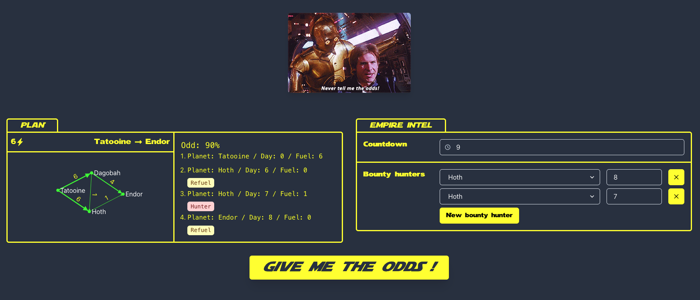

# Give me the odds

1. [Server](#server)
   1. [Run locally](#ocal)
   2. [Run on Docker](#docker)
   3. [Test with cURL](#curl)
   4. [Run automated tests](#tests)
2. [CLI](#cli)
3. [Web application](#web)
4. [Algorithm](#algorithm)

<br />
<br />

# Server <a name="server"></a>

The server is written in Python 3.9 with FastAPI and served with Uvicorn.
There is no particular reason to choose an async framework over a sync one for this exercise,
I am just more familiar with FastAPI than with Flask at this moment.

The server can either be started via a virtual env (using Poetry) or via a docker container.

## Run locally <a name="local"></a>

Local install require Python 3.9 and Poetry installed.

```sh
cd backend # Move to the backend/server directory
poetry config virtualenvs.in-project true # Set config: create .venv/ in current dir
poetry install # Install deps
source $(poetry env info --path)/bin/activate # activate virtual env
python3 ./run.py examples/example1/millennium-falcon.json # Start the server with MillenniumFalcon JSON file
```

The server should be up and running. You can now [Test with cURL](##curl).

## .. or Run on Docker <a name="docker"></a>

Docker install requires... Docker.

```sh
cd backend  # Move to the backend/server directory
docker build . -t millennium_falcon --target prod # Build production image
docker run \
 --rm \
 -it \
 -p 8080:8080  \
 -v $(pwd):/app \
 millennium_falcon \
 python3 ./run.py examples/example1/millennium-falcon.json
# Start the server with MillenniumFalcon JSON file
```

The server should be up and running. You can now [Test with cURL](##curl).

## Test with cURL <a name="curl"></a>

When the server is running (either locally or via Docker), you can compute the odd with an example `empire.json` file, from the backend directory:

```sh
curl -i -X POST http://localhost:8080/api/odds \
   -H 'Content-Type: application/json' \
   -d @examples/example1/empire.json
```

The API call return a JSON object containin the odd of success `(0<odd<100)` with the route the MillenniumFalcon should follow.

```
HTTP/1.1 200 OK
date: Sun, 04 Sep 2022 15:38:43 GMT
server: uvicorn
content-length: 283
content-type: application/json

{"odd":81.0,"plan":[
   {"planet":"Tatooine","day":0,"fuel":6,"refill":false,"hunted":false},
   {"planet":"Hoth","day":6,"fuel":0,"refill":true,"hunted":true},
   {"planet":"Hoth","day":7,"fuel":1,"refill":false,"hunted":true},
   {"planet":"Endor","day":8,"fuel":0,"refill":false,"hunted":false}
]}
```

## Run automated tests <a name="tests"></a>

The server is tested with Python standard lib's Unittest package.
Running the test suite requires the python desp to be installed.

You can run the test suite either on local or on Docker. The command is:

```sh
cd backend # Move to the backend directory
source $(poetry env info --path)/bin/activate # Activate venv
python -m unittest discover -s tests -v # Run the tests within ./tests/ directory
```

I usually test with Pytest (because the fixture design and architecture is more convenient), but Unittest is good enough and standard for this project.


<br />
<br />

# CLI <a name="cli"></a>

A CLI is also available if you dont want to run the server.
It still requires python deps to be installed (because it relies on Pydantic for data modelling and validation).

You can run the CLI either on local or on Docker. The command is:

```sh
cd backend # Move to the backend directory
source $(poetry env info --path)/bin/activate # Activate venv
./give_me_the_odds.py examples/example1/millennium-falcon.json examples/example1/empire.json
```

I could have made the CLI using only Python standard lib, but it would have been more complicated with data modelling and validation.
So the tradeoff was to have python deps installed also for the CLI.

<br />
<br />

# Web application <a name="web"></a>

The web application is built with CreateReactApp, React, Typescript, ChakraUI and ReactQuery.

Once the server is started (it should run on `0.0.0.0:8080`, but you can edit the `proxy` in `package.json` if necessary).
You should be able to start the web application on WebpackDevServer with:

```sh
cd frontend # Mode to frontend/web app directory
pnpm install # Install deps, you can use yarn or just npm
npm run start # Start the web server and serve the react app
```

You should visit [`http://localhost:8080`](http://localhost:8080) and start playing with the app.




<br />
<br />

# Algorithm <a name="algorithm"></a>

The algorithm is contained in the file `backend/app/lib.py:give_me_the_odds`.
<br />
<br />
It is based on a DFS recursing traversal from the arrival planet.


It has 2 main steps:
- Compute all the valid routes for the MillenniumFalcon to reach the `arrival` planet before the end of the `countdown`.
- From those valid routes, compute the route that minimizes the number of encounters with the bounty hunters.

<br />

It works the following:
- Recursively from the a `MillenniumFalconPlanNode`  get the possible states (planet, min autonomy and max days elapsed before countdown) from where the MillenniumFalcon could have been.
- Append the valids (ie. countdown not elapsed and fuel quantity <= autonomy) previous state to a list
- When the current state planet is the departure planet at day 0, then return from the recursion

<br />
<br />

At the end, the recursion algorithm `generate_plans_recursive` returns a list of `MillenniumFalconPlanNode` that we can traverse through the `parent` field.
<br />
Then we only need to iterate through all the possible routes and get the one with maximum odd in `find_best_plan`.


<br />
<br />

(As a side note, the algorithm can be further optimized. The current implementation is dependant on the countdown value.
We could update the implementation to not depend on the countdown value and "extend" existing routes if the starting node
is not at day 0. For instance instead of generating all the possible routes, simply generate the routes with arrival at day=countdown. 
Then extend the route if the starting node does not start at day 0. We can discuss this part in the debrief)
